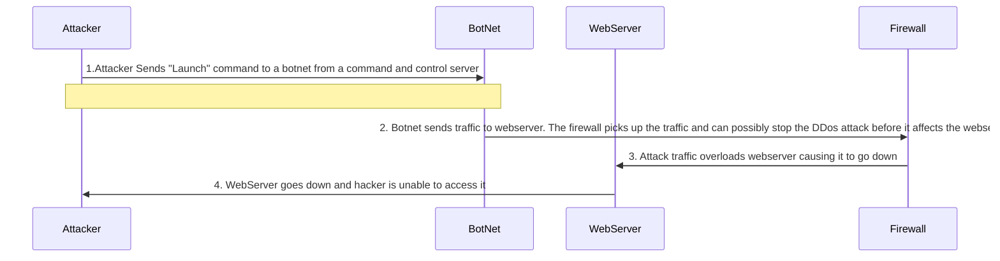

```mermaid
sequenceDiagram
participant Attacker
participant BotNet
participant WebServer
participant Firewall

Attacker ->> BotNet: 1.Attacker Sends "Launch" command to a botnet from a command and control server

note over Attacker,BotNet: 

BotNet ->> Firewall: 2. Botnet sends traffic to webserver. The firewall picks up the traffic and can possibly stop the DDos attack before it affects the webserver
Firewall ->> WebServer: 3. Attack traffic overloads webserver causing it to go down
WebServer ->> Attacker: 4. WebServer goes down and hacker is unable to access it
```