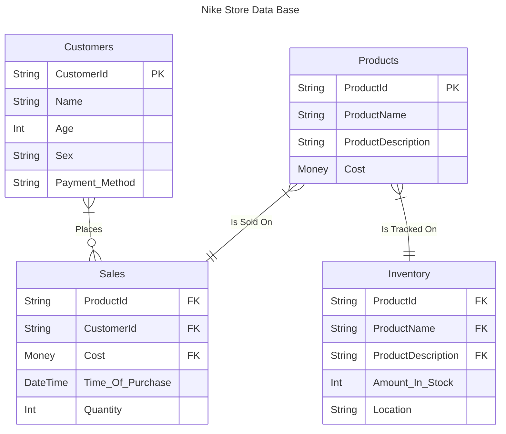

# Description

## Customers contains info on all customers
#### CustomerId - Identifies customer
#### Name - Customer's name
#### Age - Customer's age
#### Sex - Customer's sex
#### Payment_Method - Customer's method of paying

## Sales contains info on a specific sale
#### CustomerId - Identifies customer
#### Cost - Cost of product
#### CustomerId - Identifies customer
#### Name - Customer's name
#### Time_Of_Purchase - Time product was purchased
#### Quantity - Amount of the product that was purchased

## Products contain info on all products
#### ProductId - Identifies product
#### ProductName - Name of product
#### ProductDescription - Description of product
#### Cost - Cost of product

## Inventory contain info on products in stock/for sale
#### ProductId - Identifies product
#### ProductName - Name of product
#### ProductDescription - Description of product
#### Amount_In_Stock - Amount of that product in stock
#### Location - List of where the product can be bought

# Relationships
## Customers to Sales: 1 Customer, 0 or more Sales

## Sales to Products: 0 or more Sales, 1 or more Products

## Products to Inventory: 1 or more Products, 1 Inventory

## Importance of these parts
#### Customers are needed to buy the products
#### Sales are needed to make money
#### Products are needed to sell a product
#### Inventory is needed to get/hold the products